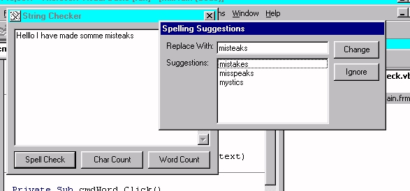



## Improved String Checker \- Spell Check/Word/Char

### Description

This code can do a few checks on some strings

1.) Check spelling using Word

2.) Counts words in a string

3.) Count the number of characters

If you want OCX source email me!

roboman1@email.com

I improved the Readme, and I did a little better example code. (Fewer Lines /Easier to use)
 
### More Info
 
refer to readme

Seperates each word and runs checks on them. the ocx is just a means of making it eaiser to handle. If you want ocx source - email me! roboman1@email.com

Requires Microsoft Word 97 or high

Only tested with English! - other language results unknown

Counts contractions as two words

             |
---                |---
**Submitted On**   |2000-04-17 11:36:06
**By**             |[Jonathan Jarvis](https://github.com/Planet-Source-Code/PSCIndex/blob/master/ByAuthor/jonathan-jarvis.md)
**Level**          |Intermediate
**User Rating**    |4.8 (19 globes from 4 users)
**Compatibility**  |VB 5\.0, VB 6\.0
**Category**       |[OLE/ COM/ DCOM/ Active\-X](https://github.com/Planet-Source-Code/PSCIndex/blob/master/ByCategory/ole-com-dcom-active-x__1-29.md)
**World**          |[Visual Basic](https://github.com/Planet-Source-Code/PSCIndex/blob/master/ByWorld/visual-basic.md)
**Archive File**   |[CODE\_UPLOAD48884172000\.zip](https://github.com/Planet-Source-Code/jonathan-jarvis-improved-string-checker-spell-check-word-char__1-7327/archive/master.zip)

